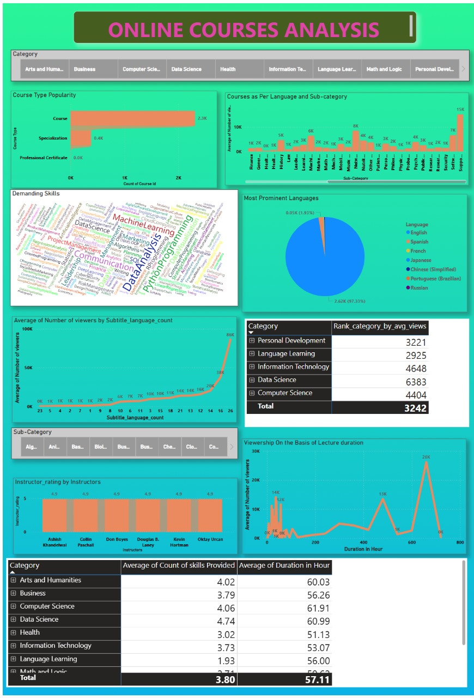

# Online Courses Analysis - Power BI Project

### Project Overview

The Online Courses Analysis project provides an in-depth exploration of online course trends using Power BI. It visually represents various key metrics, such as course popularity, language distribution, instructor ratings, demand for skills, and viewership trends. The project aims to help educators, students, and online learning platforms gain insights into market demand, course effectiveness, and learner preferences.

## Features and Insights

1. Category Selection

* A navigation bar at the top allows users to filter courses based on categories such as:
* Arts and Humanities
* Business
* Computer Science
* Data Science
* Health
* Information Technology
* Language Learning
* Math and Logic
* Personal Development